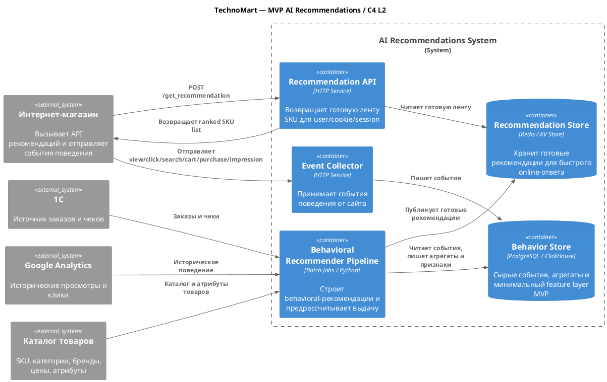
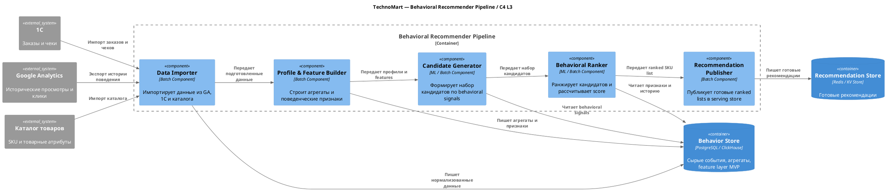
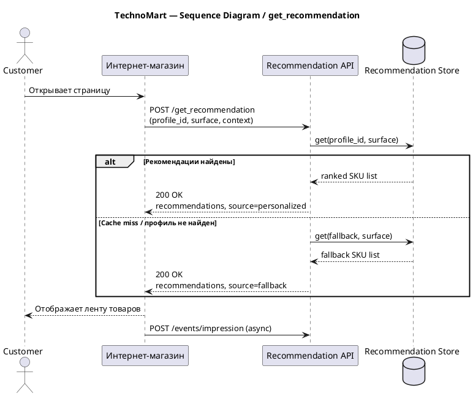

Главное техническое противоречие проекта — требование выдавать рекомендации за 200 мс при желании бизнеса использовать LLM для «умных» рекомендаций. В онлайне это несовместимо: если запускать тяжелое ранжирование и генерацию текста в момент запроса, SLA будет нарушен. Поэтому онлайн-контур должен только читать уже готовый результат, а тяжелая обработка должна выполняться асинхронно. 

Полноценный AI-контур с LLM, зрелым MLOps и омниканальностью нереалистично считать MVP на 3 месяца. У заказчика перегруженный монолит Bitrix/MySQL, собственных сырых логов почти нет, поведение в основном находится в Google Analytics, а отдельной команды Data Scientists / Data Engineers нет. 

Поэтому с заказчиком был согласован компромисс: в MVP идем не в LLM-first сценарий, а в behavioral recommender, параллельно начиная сбор собственных сырых событий и формирование минимального feature layer для будущего ML-контура. LLM сознательно откладывается на следующий этап: она может улучшить объяснение рекомендаций, но не решает ключевую задачу — подбор и ранжирование SKU. Это дает заказчику понятный ML-вектор, не ломает сайт и создает фундамент для последующего развития. 

Ниже — **C4 L2** и **C4 L3**: контейнерная диаграмма системы и компонентная диаграмма одного контейнера. 

## C4 L2 — Container Diagram

[SWG](./diagrams/C4L2.svg) [PUML](./diagrams/C4L2.puml)
### Описание контейнеров

* **Recommendation API** — online-вход в систему; быстро возвращает уже готовую выдачу.
* **Event Collector** — собирает новые события поведения с сайта.
* **Behavior Store** — хранит сырые события и простые агрегаты/признаки для MVP.
* **Behavioral Recommender Pipeline** — batch-контур, где строится behavioral recommender.
* **Recommendation Store** — low-latency хранилище предрассчитанных рекомендаций.

## C4 L3 — Component Diagram для `Behavioral Recommender Pipeline`

[SWG](./diagrams/C4L3.svg) [PUML](./diagrams/C4L3.puml)

### Описание компонентов

* **Data Importer** — подтягивает в единый контур историю поведения, покупки и каталог.
* **Profile & Feature Builder** — собирает минимальный feature layer MVP.
* **Candidate Generator** — формирует кандидатов для каждого профиля.
* **Behavioral Ranker** — считает скор и строит итоговый ranking.
* **Recommendation Publisher** — выгружает готовые рекомендации в serving-store для online API.

## Sequence Diagram

[SWG](./diagrams/SD.svg) [PUML](./diagrams/SD.puml)

## OpenAPI 3.0 — `/get_recommendation`

Ниже представлена спецификация для взаимодействия между сайтом и AI Service. Она покрывает основной happy path, fallback и ошибки.

[openapi-recommendation-api.yaml](./openapi-recommendation-api.yaml)

### Описание endpoint-ов

* `POST /get_recommendation` — основной контракт между сайтом и AI Service.
* 
* API возвращает **готовый ranked SKU list**, а не инициирует online-обучение или вызов LLM.
* При отсутствии персональной выдачи сервис возвращает **fallback**.
