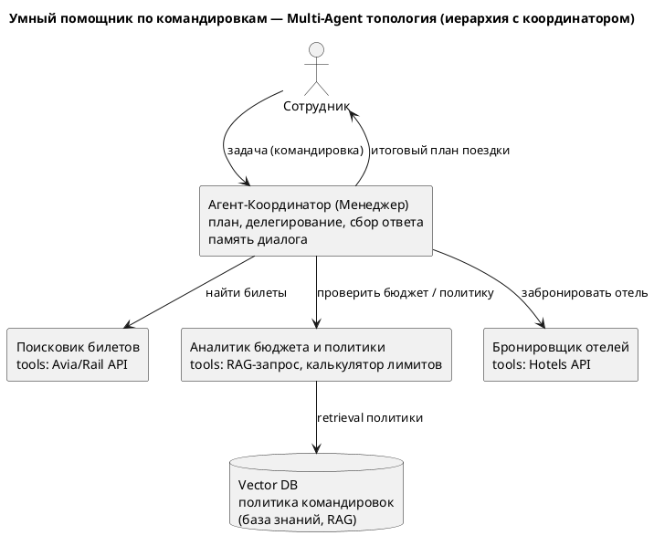
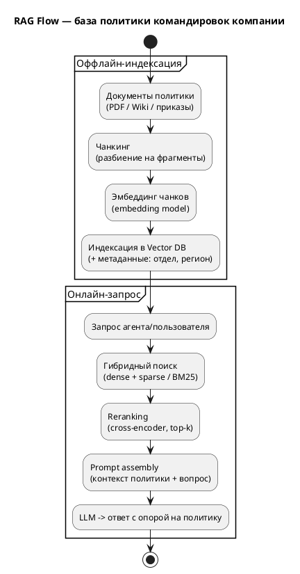
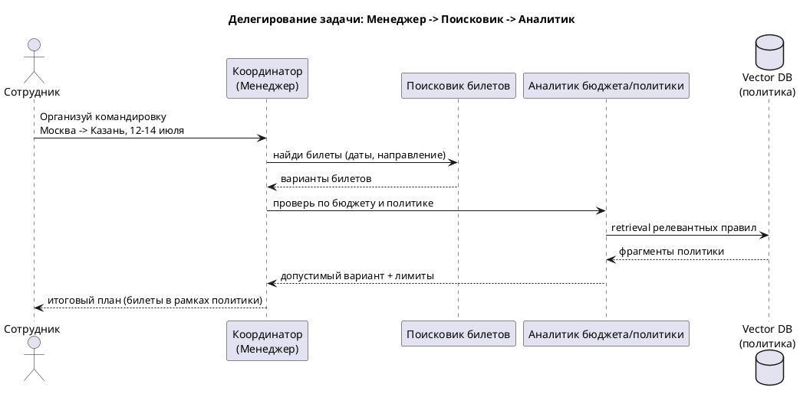

# ДЗ-03. RAG + мультиагентная система «Умный помощник по командировкам»

Самостоятельный кейс (не TechnoMart): проектируем подсистему «Умный помощник» для оформления командировок — мультиагентная система с RAG поверх внутренней политики командировок компании.

---

## Часть A. Декомпозиция агентов (Single Responsibility)

Каждый агент отвечает за одну зону ответственности (SRP), имеет свои инструменты (tools) и память.

| Агент | Зона ответственности | Tools | Память |
|---|---|---|---|
| **Координатор (Менеджер)** | Понять задачу, построить план, делегировать, собрать итог | вызовы суб-агентов | краткосрочная (контекст диалога) |
| **Поисковик билетов** | Найти варианты перелёта/поезда | Avia/Rail API | краткосрочная (параметры поиска) |
| **Аналитик бюджета и политики** | Проверить варианты на соответствие политике и лимитам | RAG-запрос к политике, калькулятор лимитов | доступ к базе знаний (RAG) |
| **Бронировщик отелей** | Подобрать и забронировать отель в рамках лимита | Hotels API | краткосрочная |

Разделение корректно по SRP: поиск билетов не знает про правила компании, аналитик не ходит во внешние API бронирования, координатор не выполняет предметную работу — только оркеструет.

---

## Часть B. Архитектура взаимодействия

Топология — **иерархия с координатором** (лекция 07): центральный Менеджер делегирует задачи специализированным агентам и собирает результат. RAG встроен в агента-Аналитика: знания о политике командировок компании лежат в **Vector DB** и подтягиваются через retrieval.



[SVG](./diagrams/topology.svg) [PUML](./diagrams/topology.puml)

**Где RAG:** база политики командировок (классы билетов, лимиты по городам, правила суточных) — это меняющиеся документы компании. Зашивать их в промпт нельзя, поэтому держим в Vector DB и достаём релевантные фрагменты под конкретный запрос.

---

## Часть C. RAG Flow (детально)

Пайплайн делится на оффлайн-индексацию (готовим базу знаний) и онлайн-запрос (агент задаёт вопрос).



[SVG](./diagrams/rag-flow.svg) [PUML](./diagrams/rag-flow.puml)

- **Чанкинг.** Документы политики бьём на фрагменты (по смысловым разделам/абзацам) с небольшим перекрытием, чтобы не рвать правила посередине.
- **Эмбеддинг.** Каждый чанк превращаем в вектор embedding-моделью; вектор + метаданные (отдел, регион, дата) пишем в **Vector DB**.
- **Retriever + гибридный поиск.** На запрос делаем **dense** (по смыслу) + **sparse/BM25** (по ключевым словам, например точный номер класса билета) — гибрид ловит и семантику, и точные совпадения.
- **Reranking.** Кандидатов прогоняем через cross-encoder reranker и оставляем top-k самых релевантных — борьба с «семантически похожим, но нерелевантным».
- **Prompt assembly.** Собираем финальный промпт: найденные фрагменты политики + вопрос; LLM отвечает строго с опорой на контекст (faithfulness), не выдумывая правил.

---

## Часть D. Прототип (псевдокод, LangGraph)

Сценарий делегирования: Менеджер получает задачу, делегирует Поисковику билетов, затем Аналитику (с RAG по политике) и собирает итог.



[SVG](./diagrams/sequence.svg) [PUML](./diagrams/sequence.puml)

Тот же сценарий в виде упрощённого псевдокода на стиле LangGraph:

```python
from langgraph.graph import StateGraph, END

# Состояние, которое передаётся между узлами графа
class TripState(TypedDict):
    request: str
    tickets: list
    policy_ok: bool
    answer: str

# --- Узлы-агенты ---
def manager(state):
    # Координатор: решает, кого вызвать дальше
    state["plan"] = plan_steps(state["request"])
    return state

def ticket_searcher(state):
    # Поисковик билетов: вызывает внешний tool
    state["tickets"] = avia_api.search(state["request"])
    return state

def policy_analyst(state):
    # Аналитик: RAG-проверка по политике
    docs = vector_db.hybrid_search(state["request"])      # dense + sparse
    docs = rerank(docs, top_k=4)                          # reranking
    prompt = assemble(context=docs, question=state["request"], tickets=state["tickets"])
    verdict = llm(prompt)                                 # ответ с опорой на политику
    state["policy_ok"] = verdict.allowed
    state["answer"] = verdict.text
    return state

# --- Сборка графа: Менеджер -> Поисковик -> Аналитик -> ответ ---
g = StateGraph(TripState)
g.add_node("manager", manager)
g.add_node("searcher", ticket_searcher)
g.add_node("analyst", policy_analyst)

g.set_entry_point("manager")
g.add_edge("manager", "searcher")     # делегирование 1
g.add_edge("searcher", "analyst")     # делегирование 2 (с RAG)
g.add_edge("analyst", END)            # возврат ответа координатором

app = g.compile()
result = app.invoke({"request": "Командировка Москва->Казань, 12-14 июля"})
print(result["answer"])
```

Поток: **Менеджер → Поисковик (билеты) → Аналитик (RAG по политике) → возврат ответа**. Аналитик использует Vector DB и reranking из Части C; координатор только оркеструет и собирает итог.
