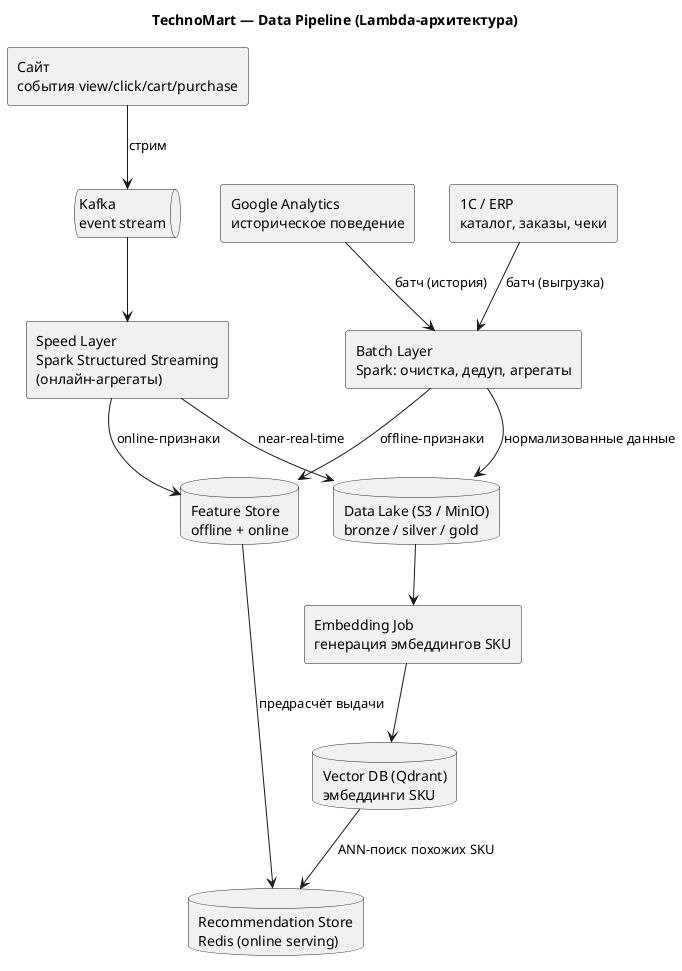
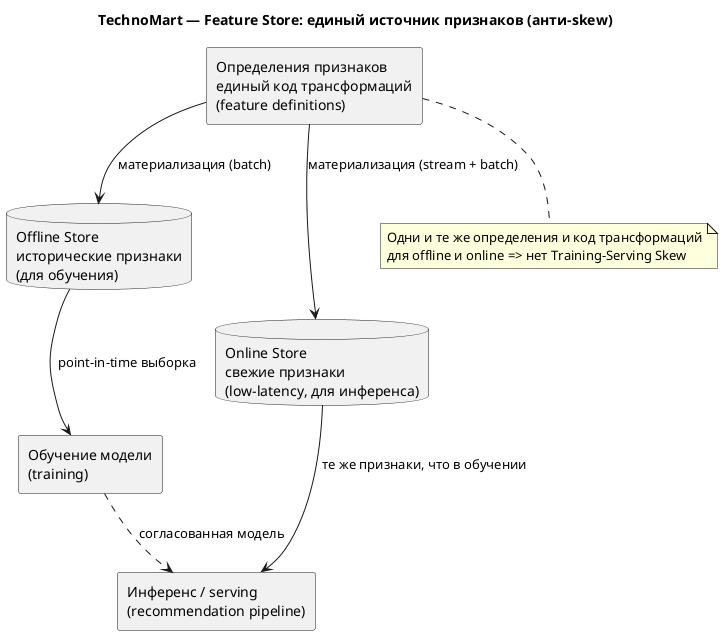

# ДЗ-05. Data Pipelines для системы рекомендаций

## Проект «Интеллектуальная система рекомендаций» для TechnoMart

Системе рекомендаций нужно регулярно обновлять данные о товарах (каталог) и поведении пользователей (клики, покупки). Ниже — источники данных, схема пайплайна (ETL/ELT), выбор хранилищ и подход к Data Governance, обеспечивающий консистентность данных между обучением и онлайн-инференсом.

---

## 1. Data Sources

Источники делятся на два класса по характеру поступления данных.

| Источник | Тип | Данные | Режим |
|---|---|---|---|
| Сайт (event-трекинг) | Стриминг | `view`, `click`, `add_to_cart`, `purchase`, `search`, `impression` | Непрерывный поток в реальном времени |
| 1C / ERP | Батч | Каталог (SKU, цены, атрибуты), заказы, чеки | Периодическая выгрузка (каталог — раз в сутки, чеки — раз в 15 мин) |
| Google Analytics | Батч | Историческое поведение за 6–12 мес. | Разовая/периодическая выгрузка |

Поведенческие события — высокочастотный поток, поэтому идут через брокер (стрим). Каталог и заказы меняются реже и большими порциями — это классический батч из legacy-систем.

---

## 2. Pipeline Design (ETL/ELT)

Применяем **Lambda-архитектуру**: батч-слой даёт полноту и точность исторических признаков, speed-слой — свежесть онлайн-признаков. Подход ELT: сырьё сначала складываем в Data Lake «как есть» (bronze), а очистку и трансформации выполняем уже внутри пайплайна (silver/gold) — это позволяет переобучать модели на исходных данных при изменении логики.

[SVG](./diagrams/data-pipeline.svg) [PUML](./diagrams/data-pipeline.puml)

**Где очистка:** в Batch Layer (Spark) — дедупликация событий, отбраковка ботов, нормализация SKU и категорий, разрешение идентичности пользователя (склейка cookie/user_id). Результат — слои silver (очищенные) и gold (агрегаты/признаки) в Data Lake.

**Где генерация эмбеддингов:** в отдельном Embedding Job, который читает gold-слой каталога (название, атрибуты, категории) из Data Lake и пишет векторы SKU в Vector DB. Это батч-процесс: эмбеддинги пересчитываются при обновлении каталога, а не на каждый запрос.

---

## 3. Storage Selection

Разным этапам — разные хранилища, под их профиль нагрузки.

| Хранилище | Технология | Назначение | Почему именно так |
|---|---|---|---|
| **Data Lake** | S3 / MinIO (+ формат Parquet, Delta/Iceberg) | Сырьё и промежуточные слои bronze/silver/gold | Дёшево, схема-on-read, хранит исходные данные для переобучения; не нагружает OLTP-базы |
| **Feature Store** | Feast (offline: S3/Parquet; online: Redis) | Согласованные признаки для обучения и инференса | Единый источник определений признаков, борьба с Training-Serving Skew |
| **Vector DB** | Qdrant | Эмбеддинги SKU, ANN-поиск похожих товаров | Профиль Vector DB: быстрый поиск ближайших соседей, метаданные-фильтры |
| **Recommendation Store** | Redis / KV | Предрассчитанная выдача для online API | Low-latency чтение под SLA 200 мс (см. HW-02) |

Сквозной стек: **Kafka → Spark (Structured Streaming + Batch) → S3 (Data Lake) → Feast (Feature Store) + Qdrant (Vector DB) → Redis (serving)**. Это прямое продолжение C4 L2 из HW-02, где online-контур только читает готовый результат.

---

## 4. Data Governance: консистентность и анти-skew

Главный риск ML-пайплайна — **Training-Serving Skew**: модель обучается на одних признаках, а в проде получает другие (из-за разного кода трансформаций offline и online). Лечится единым Feature Store.

[SVG](./diagrams/feature-store.svg) [PUML](./diagrams/feature-store.puml)

Меры обеспечения консистентности:

- **Единые определения признаков.** Признак (например, `purchases_30d`) описывается один раз; и offline-, и online-store материализуются из одних и тех же определений и кода трансформаций.
- **Point-in-time correctness.** При сборке обучающей выборки берутся значения признаков «на момент события», а не текущие — иначе в обучение «протекает» будущее (data leakage).
- **Версионирование данных и датасетов** (DVC): фиксируем, на какой версии данных обучена модель, для воспроизводимости.
- **Data Quality + lineage.** Проверки качества (свежесть, доля null, диапазоны) на входе в Feature Store; прослеживаемость источника каждого признака.

Итог: данные прослеживаются от источника (сайт/1C/GA) до модели, признаки в обучении и проде идентичны, а сырьё в Data Lake позволяет безопасно переобучать модель при изменении логики.
