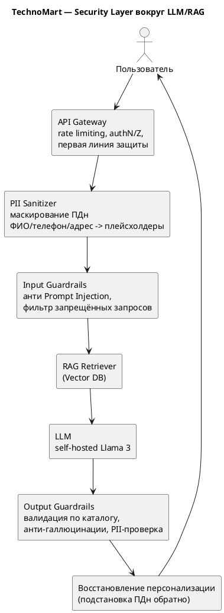
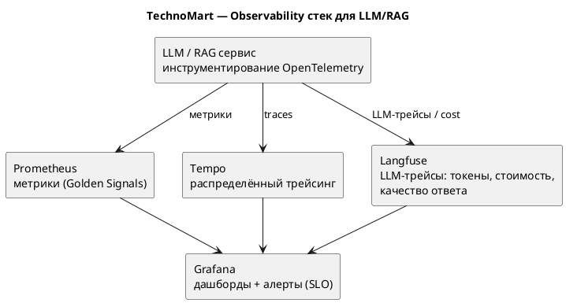

# ДЗ-06. QA + Security + Observability

## Проект «Интеллектуальная система рекомендаций» для TechnoMart

Доводим LLM/RAG-слой до Production-ready состояния: добавляем слой безопасности, описываем стратегию тестирования качества RAG и проектируем дашборд наблюдаемости.

---

## 1. Security Layer

Для LLM периметровая модель не работает: входные данные приходят от пользователя и не доверены. Поэтому защита встроена в сам поток запроса — каскад из санитайзера и guardrails вокруг модели.

[SVG](./diagrams/security-layer.svg) [PUML](./diagrams/security-layer.puml)

**Ключевые компоненты:**

- **PII Sanitizer** — перед отправкой в LLM маскирует ПДн (ФИО, телефоны, адреса) на плейсхолдеры (закрывает риск R2 из HW-01 и согласуется с ADR из HW-04). Персонализация возвращается уже после генерации.
- **Input Guardrails** — защита от Prompt Injection: проверка и фильтрация пользовательского ввода, отсечение попыток «забыть инструкции» и вытащить системный промпт.
- **Output Guardrails** — валидация ответа модели по данным каталога (анти-галлюцинации: модель не должна выдумывать характеристики/цены) и финальная проверка, что в ответ не просочились ПДн.

**Учтённые риски OWASP Top 10 for LLM:**

| OWASP LLM | Риск | Меры в нашей архитектуре |
|---|---|---|
| LLM01 Prompt Injection | Подмена инструкций через ввод | Input Guardrails, наименьшие привилегии для RAG |
| LLM02 Sensitive Information Disclosure | Утечка ПДн в/из модели | PII Sanitizer на входе + PII-проверка на выходе |
| LLM05 Improper Output Handling | Невалидированный ответ модели | Output Guardrails, валидация по каталогу |
| LLM06 Excessive Agency | Излишние права компонента | Принцип наименьших привилегий, Human-in-the-Loop на чувствительных действиях |
| LLM08 Vector/Embedding Weaknesses | Отравление RAG-базы | Контроль источников документов, проверки на этапе индексации |

---

## 2. Testing Strategy (качество RAG)

Классическое тестирование не подходит: вывод недетерминирован и текстовый. Оцениваем качество специализированными RAG-метриками.

**Метрики (лекция 13):**

| Метрика | Что измеряет |
|---|---|
| **Faithfulness** | Опирается ли ответ на найденный контекст (нет галлюцинаций) |
| **Answer Relevancy** | Релевантен ли ответ вопросу пользователя |
| **Context Precision / Recall** | Качество retrieval: нашли ли нужный контекст и не натащили ли лишнего |

**Инструмент:** **Ragas** (можно DeepEval) поверх Golden Dataset из типовых вопросов/эталонов; для регрессий промптов — promptfoo.

**Четырёхэтапный план тестирования:**

1. **Офлайн-оценка.** Прогон на Golden Dataset, расчёт Faithfulness/Answer Relevancy/Context Recall в Ragas. Сравнение моделей/конфигураций RAG между собой.
2. **Интеграционное тестирование.** Проверка всего пайплайна (sanitizer → retriever → LLM → guardrails) на тестовом стенде, контракты компонентов.
3. **Pre-release / канареечные промпты.** Release gate: набор канареечных промптов (в т.ч. на Prompt Injection и PII-утечки) обязан проходить до выката.
4. **Production-мониторинг.** Непрерывный сбор качества и безопасности на реальном трафике (часть метрик считаем выборочно через LLM-as-judge), алерты при деградации.

---

## 3. Observability

Наблюдаемость как архитектурное свойство: сервис инструментирован OpenTelemetry, метрики/трейсы уходят в стек, дашборды и алерты — в Grafana.

[SVG](./diagrams/observability.svg) [PUML](./diagrams/observability.puml)

**Стек:** Prometheus (метрики) + Tempo (трейсинг) + Langfuse (LLM-специфичные трейсы, токены, стоимость, качество) + Grafana (визуализация и алерты).

**Список виджетов дашборда Grafana** — Golden Signals + AI-метрики:

| # | Виджет | Тип метрики | Зачем |
|---|---|---|---|
| 1 | **Latency** p50/p95/p99 ответа | Golden Signal | Контроль SLA (online ≤ 200 мс, генерация — отдельный SLO) |
| 2 | **Traffic** — RPS/RPM по эндпоинтам | Golden Signal | Нагрузка, тренды, планирование ёмкости |
| 3 | **Errors** — доля ошибок (4xx/5xx, таймауты LLM) | Golden Signal | Здоровье сервиса, триггер алертов |
| 4 | **Saturation** — утилизация GPU/VRAM, длина очереди | Golden Signal | Узкие места, сигнал к масштабированию (см. HW-09) |
| 5 | **Token usage** — input/output токены/мин | AI-метрика | База для контроля стоимости |
| 6 | **Average Cost per Request** | AI-метрика | FinOps: стоимость запроса (см. HW-10) |
| 7 | **RAG quality** — Faithfulness / Answer Relevancy (выборочно) | AI-метрика | Деградация качества ответов |
| 8 | **Security** — частота сработки guardrails / prompt injection rate | AI-метрика безопасности | Атаки и утечки ПДн |

**Алертинг (SLO):** алерты на рост p99-latency, error rate, насыщение GPU и падение RAG-качества ниже порога — с уведомлением в Telegram/дежурный канал.
