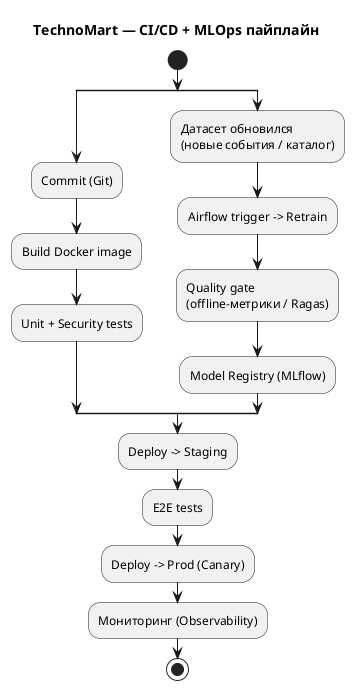
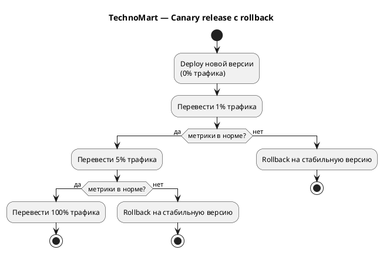

# ДЗ-08. IaC + CI/CD + MLOps

## Проект «Интеллектуальная система рекомендаций» для TechnoMart

Проектируем автоматизированный конвейер доставки кода и моделей в production: инфраструктура как код, CI/CD-пайплайн, интеграция с переобучением модели (MLOps) и безопасная стратегия релиза (Canary).

---

## 1. Infrastructure as Code (Terraform)

Инфраструктура поднимается декларативно. Псевдокод Terraform для ключевых ресурсов (K8s-кластер, GPU node pool под inference, объектное хранилище, vector DB):

```hcl
# Удалённый state (чтобы команда работала с одной версией инфраструктуры)
terraform {
  backend "s3" {
    bucket = "technomart-tfstate"
    key    = "prod/infra.tfstate"
  }
}

# Kubernetes-кластер
resource "k8s_cluster" "main" {
  name    = "technomart-prod"
  version = "1.30"
}

# Пул обычных узлов (API, сервисы)
resource "k8s_node_pool" "cpu" {
  cluster = k8s_cluster.main.id
  size    = "standard-4cpu-16gb"
  scaling { min = 3, max = 10 }
}

# GPU node pool под inference LLM (см. HW-07: A100-80G)
resource "k8s_node_pool" "gpu" {
  cluster   = k8s_cluster.main.id
  gpu_type  = "a100-80gb"
  size      = "gpu-a100-1"
  scaling   { min = 3, max = 6 }   # 3 реплики под 1000 RPM + запас
  taints    = ["nvidia.com/gpu=present:NoSchedule"]
}

# Объектное хранилище: Data Lake + артефакты моделей
resource "s3_bucket" "data_lake"     { name = "technomart-datalake" }
resource "s3_bucket" "model_registry" { name = "technomart-models" }

# Vector DB (Qdrant) под эмбеддинги SKU
resource "helm_release" "qdrant" {
  name       = "qdrant"
  chart      = "qdrant/qdrant"
  namespace  = "vectordb"
}
```

Принципы: декларативность, удалённый state, переиспользуемые модули, отдельные node pool под GPU (дорогой ресурс — изолируем и масштабируем отдельно).

---

## 2. CI/CD Pipeline



[SVG](./diagrams/cicd-mlops.svg) [PUML](./diagrams/cicd-mlops.puml)

Базовый поток кода: `Commit -> Build Docker -> Unit Tests -> Deploy to Staging -> E2E Tests -> Deploy to Prod`. Между этапами стоят quality gates: сборка/юнит-тесты/security-скан обязаны пройти, иначе пайплайн останавливается. Минимум ручных действий — единственная «ручка» — подтверждение продвижения Canary (опционально автоматизируется).

---

## 3. MLOps Integration

Особенность AI CI/CD — три артефакта: код + данные + модель. Конвейер кода связан с переобучением модели через Model Registry:

`Обновился датасет -> Airflow Trigger -> Retrain -> Quality Gate -> Model Registry -> Trigger CI/CD (деплой модели)`

- **Airflow** оркеструет переобучение по триггеру (новые данные) или расписанию (борьба с дрейфом, риск R4 из HW-01).
- **Quality gate**: новая модель проходит офлайн-оценку (метрики качества, для RAG — Ragas из HW-06). Не прошла — версия отклоняется, алерт.
- **Model Registry (MLflow)** хранит версии модели; именно регистрация новой версии триггерит CI/CD на деплой. Это и есть связь «код приложения ↔ артефакт модели».

---

## 4. Release Strategy — Canary

Деплой и релиз разделены: новая версия сначала выкатывается без трафика, затем трафик переключается постепенно (взвешенная маршрутизация на ingress / service mesh).



[SVG](./diagrams/canary.svg) [PUML](./diagrams/canary.puml)

**Переключение трафика:** `1% -> 5% -> 100%`, управление весами через ingress/service mesh; на каждом шаге — выдержка под наблюдением.

**Метрики отката (rollback triggers):**

| Метрика | Порог отката |
|---|---|
| Error rate (5xx, таймауты LLM) | рост выше базовой версии |
| Latency p99 | выше SLO |
| RAG-качество (Faithfulness / Answer Relevancy) | падение ниже порога |
| GPU saturation / длина очереди | насыщение, риск деградации |

При срабатывании любого триггера — автоматический **rollback** на предыдущую стабильную версию. Для нулевого риска новую модель можно предварительно прогнать в **Shadow mode** (зеркалирование трафика без влияния на ответы пользователю).
