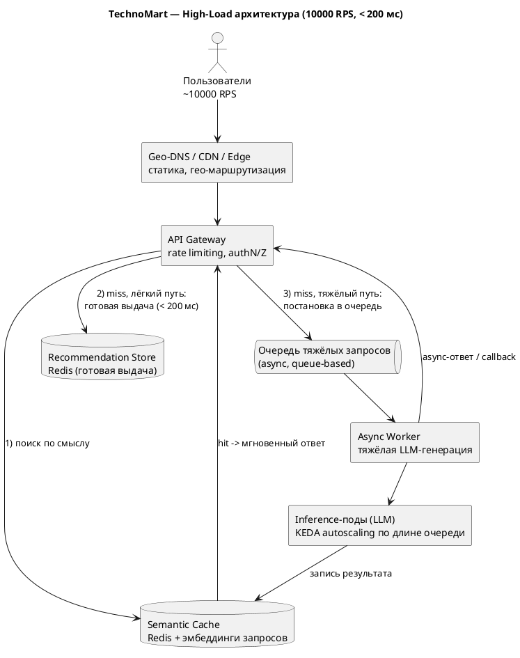

# ДЗ-09. High-Load / Real-time (10000 RPS, < 200 мс)

## Проект «Интеллектуальная система рекомендаций» для TechnoMart

Сервис вырос: нагрузка ~10000 RPS при требовании Latency < 200 мс. Оптимизируем архитектуру кэшированием, горизонтальным масштабированием и асинхронной обработкой тяжёлых запросов.

---

## Оптимизированная High-Load архитектура

[SVG](./diagrams/high-load.svg) [PUML](./diagrams/high-load.puml)

---

## 1. Caching Strategy

Многоуровневое кэширование снимает основную нагрузку до того, как она дойдёт до дорогой LLM.

| Уровень | Что кэшируется | Эффект |
|---|---|---|
| **CDN / Edge** | Статика, обезличенные популярные блоки | Разгрузка origin, близость к пользователю |
| **API Gateway** | Короткоживущие ответы, rate limiting | Защита от всплесков |
| **Redis Semantic Cache** | Ответы LLM по смыслу запроса (эмбеддинги) | Главный рычаг: снимает нагрузку с LLM |
| **Recommendation Store** | Предрассчитанная выдача (из HW-02) | Лёгкий online-путь под 200 мс |

### Алгоритм Semantic Cache

В отличие от обычного кэша (точное совпадение ключа), семантический кэш ловит запросы, **близкие по смыслу**:

1. Построить эмбеддинг входящего запроса.
2. ANN-поиск ближайших запросов в векторном индексе кэша.
3. Если косинусная близость ≥ порога (например, 0.95) — это **hit**: вернуть закэшированный ответ, не вызывая LLM.
4. Если ниже порога — **miss**: выполнить запрос (готовая выдача или генерация), затем записать `эмбеддинг запроса + ответ` в кэш с TTL.

Риски (лекция 24): слишком низкий порог даёт ложные попадания (выдаём не тот ответ); для персонализированных ответов кэшируем только обезличенные/сегментные результаты. TTL ограничивает протухание.

---

## 2. Scaling

- **Горизонтальное масштабирование** inference-подов (stateless-обвязка вокруг LLM), балансировка нагрузки.
- **KEDA autoscaling по длине очереди**, а не по CPU: для LLM CPU/GPU-утилизация плохо отражает нагрузку (memory-bound, см. HW-07). KEDA смотрит на длину очереди запросов и поднимает поды, когда очередь растёт, и гасит, когда пустеет. Это адекватнее для GPU-инференса, у которого автомасштабирование по «железным» метрикам запаздывает.

---

## 3. Async Processing

Тяжёлые запросы (полноценная LLM-генерация) **нельзя** обслуживать синхронно под SLA 200 мс. Поэтому:

- лёгкий путь (готовая выдача из Recommendation Store + semantic cache hit) отвечает синхронно и укладывается в 200 мс;
- тяжёлый путь переводится на **queue-based** модель: запрос ставится в очередь, обрабатывается async-воркерами на inference-подах, результат отдаётся по callback/поллингу и кладётся в semantic cache, чтобы следующий похожий запрос получил hit.

Это прямое продолжение принципа из HW-02: онлайн-контур только читает готовое, тяжёлое выполняется асинхронно.

---

## 4. Global Distribution (опционально)

Если аудитория распределена географически:

- **Geo-DNS** маршрутизирует пользователя в ближайший регион — снижает сетевую задержку (RTT), что напрямую помогает уложиться в 200 мс.
- **Edge computing / CDN** обслуживает статику и обезличенные популярные ответы близко к пользователю, оставляя в центр только тяжёлую персонализированную генерацию.

---

## Итог: как выполняются требования

| Требование | Чем обеспечено |
|---|---|
| **< 200 мс** | Semantic cache + предрассчитанная выдача на лёгком пути, Geo-DNS/Edge для близости |
| **10000 RPS** | Кэш снимает большую часть нагрузки с LLM; горизонтальное масштабирование + KEDA по очереди; CDN разгружает origin |
| **Тяжёлая генерация без срыва SLA** | Async queue-based обработка вне синхронного пути |
